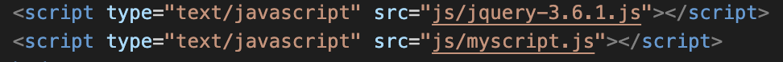

# Download and Install jQuery

## Two versions of jQuery:

- Production version: Use this version for your live project.
- Development version: Use this version for testing and development.

# How to Install jQuery for development:

1. Go to [jQuery download page](https://jquery.com/download/).
2. Right click on the latest uncompressed version of jQuery (3.6.1 - at the time of this article.)
3. Click on "save link" as.
4. Create a new folder in your project if you haven't already so (I'll call mine js).
5. Copy the jquery file we saved earlier into the js folder.
6. Link your jquery file to your html page on top of your javascript file (mine is called myscript.js).

- 

---

Happy coding!
